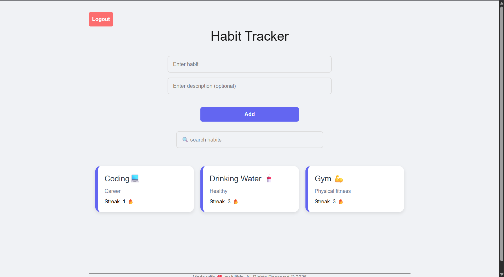
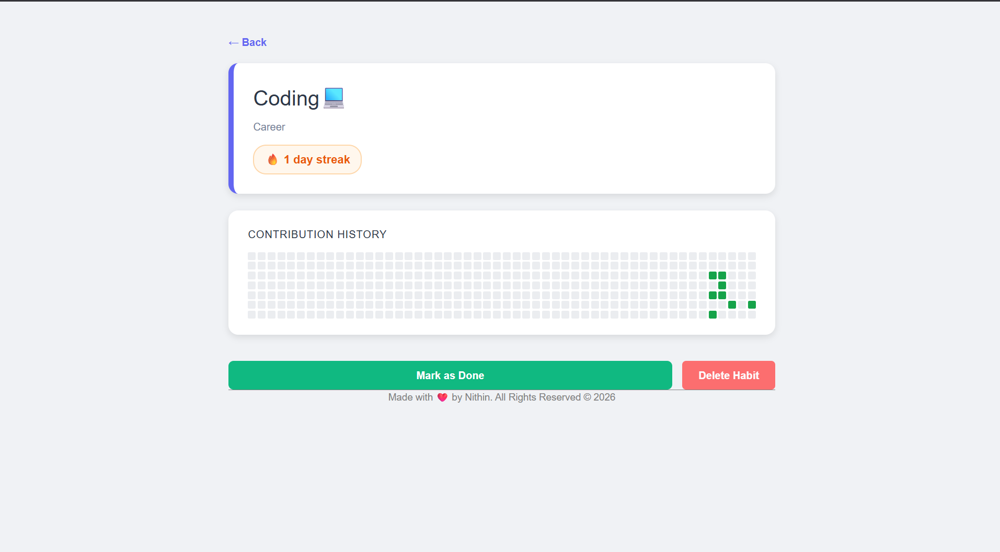

# Habit Tracker 🔥

A full-stack habit tracking app built with the MERN stack. Track your daily habits, build streaks, and stay consistent — with each user having their own private habit list.You can track ad see Your consistency visually in github contribution grid style.

## 🚀 Live Demo

🔗 **Demo:** [Add Demo Link Here](#)

---

## Features

- *User Authentication* — Register and login with JWT-based auth
- *Personal Habits* — Each user sees only their own habits
- *Streak Tracking* — Mark habits as done and build daily streaks
- *One Completion Per Day* — Can't inflate streaks by spamming the button
- *CRUD Operations* — Add, delete, and view habits
- *Protected Routes* — Habit tracker is inaccessible without login

---

## Tech Stack

*Frontend*
- React (Vite)
- React Router DOM
- Axios

*Backend*
- Node.js
- Express.js
- Mongo

---

## 📸 Screenshots

### Home Page

### Habit Dashboard

---

## Project Structure

habit-tracker/
├── Back-end/
│   ├── middleware/
│   │   └── authMiddleware.js
│   ├── models/
│   │   ├── User.js
│   │   └── habit.js
│   ├── routes/
│   │   ├── authRoutes.js
│   │   └── habit.js
│   ├── .env
│   └── index.js
│
└── Front-end/react-app/
    └── src/
        ├── api/
        │   └── axios.js
        ├── components/
        │   └── Habit.jsx
        ├── pages/
        │   ├── HabitTracker.jsx
        │   ├── Login.jsx
        │   └── Register.jsx
        ├── App.jsx
        └── main.jsx

### Prerequisites

- Node.js
- MongoDB (local or Atlas)

### Backend Setup

bash
cd Back-end
npm install

Create a .env file:

MONGO_URL=your_mongodb_connection_string
JWT_SECRET=your_jwt_secret_key

Start the server:
bash
nodemon index.js

Server runs on http://localhost:3000

### Frontend Setup

bash
cd Front-end/react-app
npm install
npm run dev

App runs on http://localhost:5173

### Auth Routes
| Method | Endpoint | Description |
|--------|----------|-------------|
| POST | /api/auth/register | Register a new user |
| POST | /api/auth/login | Login and receive JWT |

### Habit Routes (Protected — requires Bearer token)
| Method | Endpoint | Description |
|--------|----------|-------------|
| GET | /api/habits | Get all habits for logged-in user |
| POST | /api/habits | Create a new habit |
| PATCH | /api/habits/:id/complete | Mark habit as done (once per day) |
| DELETE | /api/habits/:id | Delete a habit |

---

## 🎯 Future Improvements

- User authentication
- Habit categories
- Weekly & monthly analytics
- Habit reminders
- Dark mode support
- Cloud sync

---

## 🤝 Contributing

Contributions, issues, and feature requests are welcome.

1. Fork the project
2. Create a feature branch
3. Commit your changes
4. Open a Pull Request

---

## 📜 License

This project is open source and available under the MIT License.

---

### ⭐ If you found this project useful, consider giving it a star!